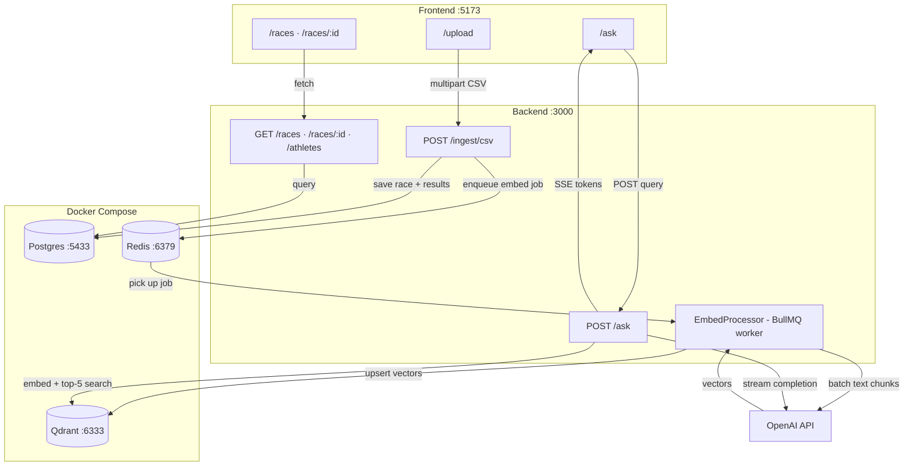
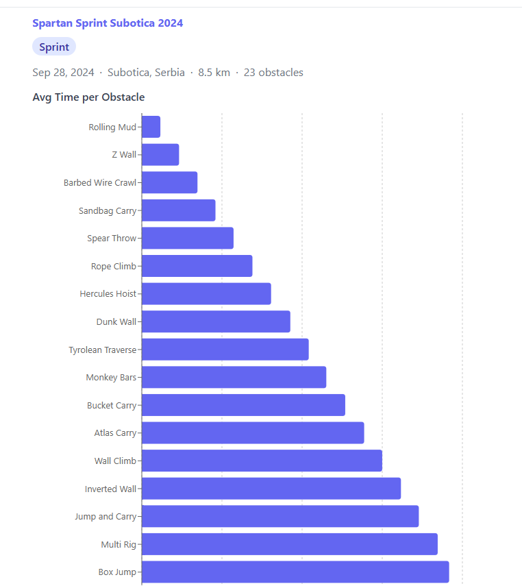
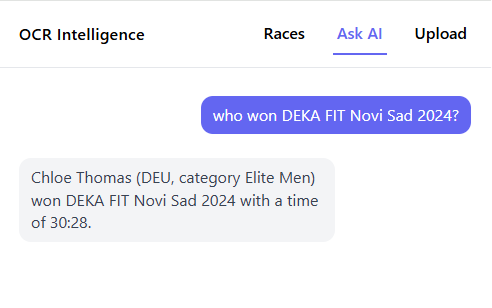

# ocr-intelligence

A full-stack portfolio project for analysing obstacle course race (OCR) data. Upload race results as CSV files, explore per-race dashboards with charts and leaderboards, and ask natural-language questions about the data — answered in real time by a retrieval-augmented generation (RAG) pipeline backed by OpenAI and Qdrant.

---

## Tech Stack

| Layer | Technology |
|---|---|
| Frontend | React 19, Vite, TypeScript, React Router v7, TanStack Query, Framer Motion, Recharts |
| Backend | NestJS, TypeORM, PostgreSQL 16 |
| Vector DB | Qdrant v1.13.6 |
| Job queue | Redis 7, BullMQ |
| AI | OpenAI `text-embedding-3-small` (embeddings), `gpt-4o-mini` (generation) |
| Monorepo | pnpm 10.33.0, Turborepo |

---

## Architecture



**Ingestion flow:** The frontend's `/upload` page POSTs a CSV to `POST /ingest/csv`. The backend parses the metadata header and result rows, saves them to PostgreSQL, then enqueues a BullMQ job in Redis. The `EmbedProcessor` worker picks up the job, serialises each result to natural-language text, embeds the chunks via OpenAI, and upserts the vectors (with payload metadata) to Qdrant.

**Query flow:** The `/ask` chat page POSTs a natural-language query to `POST /ask`. The backend embeds the query, retrieves the top-5 most similar chunks from Qdrant, assembles a prompt, streams a completion from `gpt-4o-mini`, and returns the tokens as a Server-Sent Events stream.

---

## Repository Layout

```
ocr-intelligence/
├── apps/
│   ├── frontend/   # React + Vite SPA
│   └── backend/    # NestJS REST API
├── packages/
│   └── types/      # Shared TypeScript DTOs (@ocr/types)
├── docker-compose.yml
└── .env.example
```

---

## Prerequisites

- [Docker](https://docs.docker.com/get-docker/) and Docker Compose
- Node.js ≥ 20.11 (required by Vite 8)
- pnpm 10.33.0 — `npm install -g pnpm@10.33.0`
- An [OpenAI API key](https://platform.openai.com/api-keys)

---

## Local Setup

### 1. Clone the repository

```bash
git clone https://github.com/polina2410/ocr-intelligence.git
cd ocr-intelligence
```

### 2. Create the root environment file

```bash
cp .env.example .env
```

Edit `.env` and fill in real values:

```dotenv
# Docker Compose — PostgreSQL
DB_USER=ocr_user
DB_PASSWORD=your-db-password
DB_NAME=ocr_db

# Docker Compose — Qdrant
QDRANT_API_KEY=your-qdrant-key

# Shared — Redis
REDIS_HOST=localhost
REDIS_PORT=6379
```

### 3. Create the backend environment file

Create `apps/backend/.env` (this file is gitignored and is separate from the root `.env`):

```dotenv
# PostgreSQL connection (NestJS reads this)
DB_HOST=localhost
DB_PORT=5433
DB_USER=ocr_user
DB_PASSWORD=your-db-password
DB_NAME=ocr_db

# Qdrant
QDRANT_URL=http://localhost:6333
QDRANT_API_KEY=your-qdrant-key

# Redis / BullMQ
REDIS_HOST=localhost
REDIS_PORT=6379

# OpenAI
OPENAI_API_KEY=your-openai-api-key

# CORS — must match the frontend origin
CORS_ORIGIN=http://localhost:5173
```

> **Note:** The root `.env.example` documents only the Docker Compose variables. The backend-only variables (`DB_HOST`, `DB_PORT`, `QDRANT_URL`, `OPENAI_API_KEY`, `CORS_ORIGIN`) must be added to `apps/backend/.env` manually as shown above.

### 4. Install dependencies

```bash
pnpm install
```

### 5. Start infrastructure

```bash
docker compose up -d
```

This starts PostgreSQL (`:5433`), Qdrant (`:6333`), and Redis (`:6379`).

### 6. Start the backend

```bash
pnpm --filter backend start:dev
```

NestJS will start on `http://localhost:3000`. On first boot it connects to Postgres and initialises the Qdrant collection.

### 7. Start the frontend

```bash
pnpm --filter frontend dev
```

Vite will start on `http://localhost:5173`.

---

## Service URLs

| Service | URL |
|---|---|
| Frontend | http://localhost:5173 |
| Backend API | http://localhost:3000 |
| Swagger UI | http://localhost:3000/docs |
| PostgreSQL | localhost:5433 |
| Qdrant | http://localhost:6333 (loopback only) |
| Redis | localhost:6379 |

---

## Environment Variables

### Root `.env` (read by Docker Compose)

| Variable | Purpose |
|---|---|
| `DB_USER` | PostgreSQL username |
| `DB_PASSWORD` | PostgreSQL password |
| `DB_NAME` | PostgreSQL database name |
| `QDRANT_API_KEY` | API key for the Qdrant service |
| `REDIS_HOST` | Redis hostname (default: `localhost`) |
| `REDIS_PORT` | Redis port (default: `6379`) |

### `apps/backend/.env` (read by NestJS)

| Variable | Purpose |
|---|---|
| `DB_HOST` | PostgreSQL host (`localhost` for local dev) |
| `DB_PORT` | PostgreSQL port (`5433` — mapped by Docker Compose) |
| `DB_USER` | PostgreSQL username (same as root `.env`) |
| `DB_PASSWORD` | PostgreSQL password (same as root `.env`) |
| `DB_NAME` | PostgreSQL database name (same as root `.env`) |
| `QDRANT_URL` | Qdrant base URL (`http://localhost:6333`) |
| `QDRANT_API_KEY` | API key for Qdrant (same as root `.env`) |
| `REDIS_HOST` | Redis hostname |
| `REDIS_PORT` | Redis port |
| `OPENAI_API_KEY` | OpenAI API key for embeddings and generation |
| `CORS_ORIGIN` | Allowed CORS origin (`http://localhost:5173`) |

---

## Loading Data

### Via the UI

Navigate to **http://localhost:5173/upload**, drag and drop a CSV file onto the upload zone, and click to confirm. The app will ingest the file and redirect to the race dashboard once complete.

### Via curl

Sample CSV fixtures are included in `apps/backend/test/fixtures/`. To ingest one directly:

```bash
curl -X POST http://localhost:3000/ingest/csv \
  -F "file=@apps/backend/test/fixtures/Spartan_Sprint_Novi_Sad_2024.csv"
```

A successful response returns the new race ID and the number of rows ingested:

```json
{ "raceId": "uuid-...", "rowsIngested": 22 }
```

Embedding runs asynchronously in the background via BullMQ. The race dashboard is available immediately; the `/ask` endpoint will return answers once embedding completes (typically a few seconds).

---

## Example RAG Queries

After ingesting at least one race, navigate to **http://localhost:5173/ask** and try questions like:

- *"Who had the fastest finish time in the Spartan Sprint Novi Sad 2024?"*
- *"Which obstacle had the highest penalty rate in the Spartan Sprint Subotica 2024?"*
- *"How did Ana Popovic perform across all the races she competed in?"*

### Via curl

`POST /ask` accepts a JSON body and returns a `text/event-stream` response. Each `data:` frame is a JSON-encoded token string; the stream ends with an `event: done` frame.

```bash
curl -N -X POST http://localhost:3000/ask \
  -H "Content-Type: application/json" \
  -d '{"query": "Who had the fastest finish time in the Spartan Sprint Novi Sad 2024?"}'
```

Example SSE output:

```
data: "The"
data: " fastest"
data: " finisher"
...
event: done
data: [DONE]
```

The full API reference is available in the Swagger UI at **http://localhost:3000/docs**.

---

## Demo Screenshots

> **Note:** Replace the placeholder images below with live screenshots once the app is running with seeded data.






---

## Contributing

See [CLAUDE.md](CLAUDE.md) for codebase conventions, project structure, and development commands.
